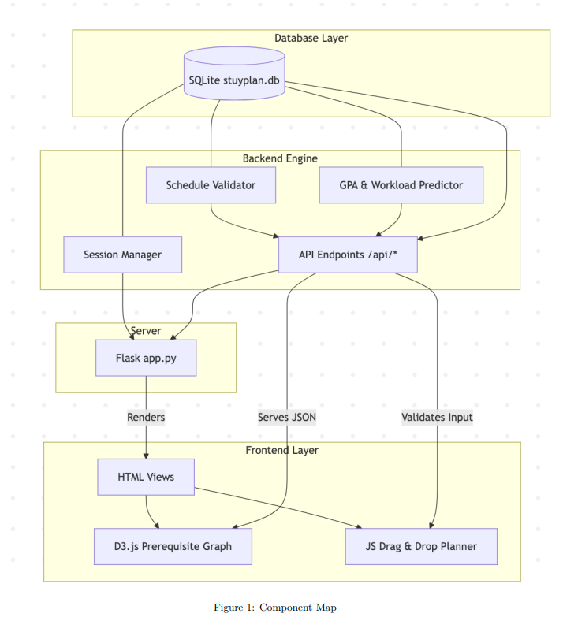
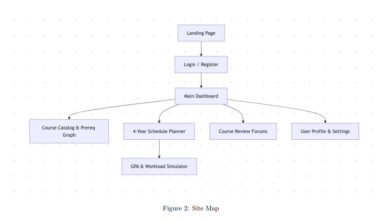

# System Blueprint (_a.k.a._ "Design Doc")

## TNPG: koalas

## project: Better Talos

## Target ship date: {2026-06-01}

---

### roster: Alexandru Cimpoiesu, Shafin Kazi, Mustafa Abdullah, Jalen Chen

| Name | Email | Primary Role | Secondary Role |
|---|---|---|---|
| Alexandru Cimpoiesu|alexandruc4@nycstudents.net| Database organizer/parser|Grade prediction algorithm developer|
| Shafin Kazi |shafink3@nycstudents.net| Javascript | (Secondary) frontend designer |
| Mustafa Abdullah|mustafaa80@nycstudents.net | API Integration/JS | Middleware manager |
| Jalen Chen|jalenc60@nycstudents.net | Frontend designer | Secondary database parser |

---

# Summary
Better Talos is to help inform Stuy students inform themselves on their classes (e.g. course rigor, course requirements, teacher evaluation, etc) and engage in public forums to discuss all things Stuy.

## Problem Being Solved
Talos does not present all of the information that students might need in an easy/meaningful way. Students might have to socialize with others in order to gleam information about courses/teachers and better inform themselves on which classes to take or not to take.

## Target Users
Who will use this system?
- Current Stuyvesant students
- Current Stuyvesant administration (guidance counselors, program office)

## Why This Project Matters
The project would help students better map out their academic path over the course of their 4 years at Stuyvesant as opposed to the current rudimentary system of blindly picking courses through Talos.

---

# Minimum Viable Product (MVP) Scope

## Core Features (Required for Final Submission)
Features that **must** be completed:
1. Online message board for discussion
2. Admin User with moderation abilities
3. Information on each course and teacher
4. Prerequisites for each course

## Stretch Features (Only if MVP is Complete)
1. Class Grade predictor
2. Workload difficulty predictor (number of hours hw)

## Explicit Non-Goals
Features intentionally excluded:
- Real-time collaborative schedule editing
- Direct integration/authentication with official DOE or Stuyvesant administrative servers

---

# Technology Stack

| Layer | Selected Tool |
|---|---|
| Backend Framework | Flask |
| Frontend Framework | tailwind |
| Database | SQLite|
| Authentication | Flask sessions |
| Data viz | d3.js |
| ORM / DB Library | N/A |

## Why This Stack Was Chosen
We chose most of these options because they are what we are most comfortable and familiar with. Tailwind offers easy, customizable, and lightweight designing.

---

# Team Ownership Plan

Each member must own meaningful deliverables.

| Team Member | Primary Ownership | Secondary Ownership | Specific Deliverables |
|---|---|---|---|
| Alexandru | DB & core algorithms | Data viz|parsing course catalog data, developing the GPA/Workload prediction algorithms, and implementing the d3.js prerequisite tree visualizations |
| Shafin | Frontend + DOM Manipulation| UI/UX| Building the drag and drop JavaScript logic for the 4 year planner, managing frontend state|
| 'Stafa | Backend Routing & API Endpoints| Middleware + auth| making flask routes, handling Flask session authentication and validating schedule constraints|
| Jalen | UI/UX | Data parsing | Tailwind + create visual layout |

---

# Component map

# Site map

---

## Key User Stories

### eg0
As a **student**, I want to visualize course prerequisites as a graph so that I can see the fastest path to advanced classes without missing required courses.

### eg1
As a student, I want to simulate my projected workload and gpa so that I can take classes that are well suited for me without too much burnout.

### eg2
As a user, I want to filter course reviews by tags so that I can select classes that align with my personal preferences.

# Database Design

| Table Name | Fields | Description |
|---|---|---|
| **Users** | `id` (INTEGER, PK), `username` (TEXT), `password`(TEXT), `grad_year` (INTEGER)| Stores basic user account and auth info |
| **Courses** | `id` (PK, INTEGER), `course_code` (TEXT), `name` (TEXT),`subject` (TEXT),`prereqs` (TEXT)| All the courses. |
| **Reviews** | `id` (PK, INTEGER), `course_code` (FK, INTEGER), `user_id` (FK), `difficulty`, `workload_hours`, `tags`, `content` | Crowdsourced data for the forum and predictor algorithms |
| **Schedules** | `id` (PK, INTEGER), `user_id` (FK, INTEGER), `course_id` (FK, INTEGER), `semester_num` (INTEGER), `year`(INTEGER) | Stores a user's planned 4 year schedule |

# Testing Plan

- Use unit tests to validate that prereqs are working properly.
- Verify prereq data to make sure no dependencies are circular.
- Make sure routes work and fix server errors before pushing to our "prod" environment.

# Timeline

## Week 1 Goals:
- Visualization of Courses & Prereqs data (proof of concept)
- flask app & sqlite db
- basic frontend created.

## Week 2 Goals:
- d3.js graph created using courses & prereqs data
- frontend UI for a drag & drop planner

## Week 3 Goals:
- connect drag and drop planner to a backend validator
- integrate the workload/GPA prediction algorithms based on database review aggregates

## Internal Deadlines:
- May 18: db fully built with course data & functioning routing
- May 20: functioning prereq site
- May 22: d3 graph created with the prereq database
- May 25: drag & drop schedule builder js made
- May 27: backend fully complete
- May 29: middleware fully completed with full algorithms & page holding student data like classes taken made
- June 1: Finishing touches, bug fixing, whatever crunch is left

# Completion Criteria (_a.k.a._ "Definition of 'Done'")

Project is considered complete when all of the following are true:  
1. Meet all MVP requirements  
2. Happy and ready to graduate >w<

# Open Questions

# Appendix
Workload Algorithm:
- It will probably be something simple like (Sum of predicted course hours) * User Speed User speed will be calculated by performance above or below average on assignments. Self-reported if no data.
